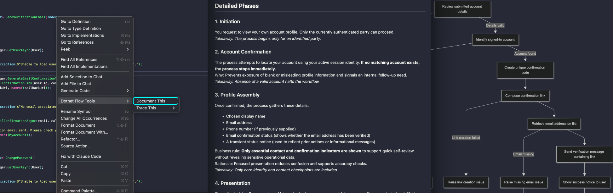

# Dotnet Flow Tools (Beta)

**Transform .NET code into clear, readable documentation**

Dotnet Flow Tools is a Visual Studio Code extension that bridges the gap between technical .NET code and business understanding. It analyzes your .NET codebase and generates comprehensive documentation that explains what your code does in business terms, making it invaluable for developers, business analysts, and technical writers.



## Why Not Just Use Copilot or Other Agentic Extensions?

**Copilot analyzes code as intelligent text. This extension analyzes code as the compiler sees it.**

While GitHub Copilot and similar AI tools excel at code generation and can answer questions across multiple files, they fundamentally treat your codebase as sophisticated text. This extension uses **Microsoft.CodeAnalysis (Roslyn)** to understand your code with true semantic analysis:

- **Precise Call Graphs**: Traces exact execution paths through complex architectures, not text-based guesses
- **Runtime Pattern Resolution**: Understands MediatR handlers, CQRS patterns, and polymorphic dispatch at the compiler level
- **Assembly-Aware Analysis**: Focuses on your business logic, filtering out framework noise
- **Solution-Wide Compilation Context**: Works with compiled semantic models, understanding cross-project dependencies that text analysis misses

**The Result**: Generate comprehensive business documentation that explains *exactly* what your technical processes do, with precision that's impossible from text-pattern analysis alone.

## 🚀 Features

### Document Generation
Right-click any C# method → **"Document This"** to generate comprehensive business documentation with call chain analysis and domain-specific examples.

### Code Flow Visualization
Right-click any C# method → **"Trace This"** to visualize execution flows:
- **All**: Complete detailed flow including POCOs/DTOs
- **Methods Only**: Filters to just method bodies 
- **MediatR Only**: Filters to only MediatR handlers

### AI Model Support
Built-in VSCode models or AWS Bedrock with easy model switching.

### Intelligent Processing
Smart chunking for large codebases, business context integration, and progress tracking.

## Requirements
- **Mermaid**: Install the Mermaid Chart extension to view the generated diagrams.  
- **.NET Solution**: Your project must contain a `.sln` solution file
- **AI Provider**: Either built-in VSCode language models or AWS Bedrock access

### Multi-solution Workspaces
- The extension scopes analysis to the workspace folder that contains your active file.
- It resolves the correct solution by:
  1) Finding the nearest project file (.csproj/.fsproj) for the active file, then
  2) Matching that project to solution(s) within the same workspace folder.
- If multiple solutions match (or no clear match is found), you’ll be prompted to select one. You can choose to remember your selection for that workspace folder.
- Optional: Set `dotnetFlow.defaultSolution` (per workspace folder) to prefer a specific solution when multiple `.sln` files exist.
- Generated documentation is saved under the matching workspace folder (e.g., `.flowdocs/`).

## Getting Started

### 1. Install the Extension
Install "Dotnet Flow Tools" Extension

### 2. Configure AI Model
1. Open the Command Palette (`Ctrl+Shift+P` / `Cmd+Shift+P`)
2. Run `DotnetFlowTools: Select AI Model`
3. Choose between built-in or Bedrock provider
4. Select your preferred model
* The above steps can also be done in the VS Code Settings UI

### 3. Set Business Context (Optional but Recommended)
1. Open VS Code Settings (`Ctrl+,` / `Cmd+,`)
2. Search for "dotnet flow"
3. Add your business domain context in the `Business Context` field. This helps generate accurate examples in the docs. 

### 4. Generate Your First Documentation
1. Open a C# file in a .NET Core or .Net 6.0+ solution
2. Place your cursor inside any method
3. Right-click and select `Dotnet Flow Tools > Document This`
4. Wait for the AI to generate comprehensive documentation

## ⚙️ Configuration

### Extension Settings

| Setting | Description | Default |
|---------|-------------|---------|
| `dotnetFlow.model` | Combined provider and model (dropdown) | _(select)_ |
| `dotnetFlow.businessContext` | Business domain context for better examples | _(empty)_ |
| `dotnetFlow.awsProfile` | AWS profile for Bedrock provider | `default` |
| `dotnetFlow.awsRegion` | AWS region for Bedrock provider | `us-east-1` |
| `dotnetFlow.defaultSolution` | Preferred solution path or filename for this workspace folder when multiple `.sln` files exist | _(empty)_ |

### Business Context Examples
Provide context about your domain to get more relevant documentation:

```
E-commerce platform specializing in B2B wholesale operations. 
Key concepts: purchase orders, supplier catalogs, bulk pricing, 
inventory management, and multi-tier customer accounts.
```

```
Healthcare management system for clinics. Focus on patient 
records, appointment scheduling, billing workflows, and 
HIPAA compliance requirements.
```

## Usage

### Document This Command
1. **Navigate** to any C# method in your solution
2. **Position** your cursor inside the method
3. **Right-click** and select `Dotnet Flow Tools > Document This`
4. **Review** the generated markdown documentation that opens automatically

### Trace Commands
Generate code execution traces for analysis:

- **Trace This: All** - Complete detailed trace with all dependencies
- **Trace This: Methods Only** - Simplified trace focusing on method calls
- **Trace This: MediatR Only** - Specialized for MediatR request handlers

### Context Menu Integration
When working with C# files, right-click anywhere to access:
```
Dotnet Flow Tools
├── Document This
└── Trace This
    ├── All
    ├── Methods Only
    └── MediatR Only
```

## AI Model Provider Setup

### Built-in Provider (Recommended for Getting Started)
1. Run `DotnetFlowTools: Select AI Model`
2. Choose "Built-in Provider"
3. Select from available VSCode language models
4. Start generating documentation immediately


> **⚠️ Token Usage with GitHub Copilot**: This extension can consume significant tokens when using the "Document This" feature on methods which highly complex call chains. Here's what you need to know about GitHub Copilot's token usage:
>
> **For paid Copilot plans (Pro/Business/Enterprise)**: GPT-4o and GPT-4.1 have a 0× multiplier, so they don't consume premium requests from your budget. However, you're still subject to soft rate limits, token/throughput caps.
>
> **For Copilot Free tier**: Every use still burns your limited premium requests, regardless of the model.
>
> **What this means in practice:**
> - **Copilot Pro/Business/Enterprise**: Use GPT-4.1 or GPT-4o as much as you want without touching your premium request pool; you may just hit temporary rate limits if you hammer it.
> - **Copilot Free**: All requests still decrement your monthly allotment.
> - **Org plans**: There can also be org-wide throttles/policies.
>
> **When you need to worry**: If you switch to models with a multiplier > 0 (e.g., Claude Sonnet/Opus, Gemini Pro), those will spend your premium requests. This is fine, just keep an eye on it.
>
> **💡 Tip**: Set GPT-4.1 as your default, and only switch to the pricier models when you truly need their longer context or different reasoning style. Track your usage under Settings → GitHub Copilot → Usage & spending.

### AWS Bedrock Provider
1. **Install AWS Toolkit**: Install the AWS Toolkit for Visual Studio Code extension
2. **Configure AWS Credentials**: Set up your AWS profile with Bedrock access
3. **Configure Extension**:
   - Set `dotnetFlow.awsProfile` to your AWS profile name
   - Set `dotnetFlow.awsRegion` to your preferred region
4. **Select Model**: Run `DotnetFlowTools: Select AI Model` and choose a Bedrock model

#### Supported Bedrock Models
- **Claude (Anthropic)**: Excellent for highly complex code

## Troubleshooting

### Common Issues
- **"No solution found"**: Ensure your workspace contains a `.sln` file
- **"Put cursor inside a method"**: Make sure your cursor is positioned within a C# method
- **"No AI provider available"**: Configure an AI model using the Select AI Model command
- **"AWS credentials not found"**: Set up AWS profile with Bedrock permissions

### Getting Help
- Check the VS Code Output panel for detailed error messages
- Ensure your .NET solution builds successfully
- Verify AI provider configuration and permissions

## Output Examples

The extension generates markdown documentation that includes:
- **Business Purpose**: What the method accomplishes in business terms
- **Process Flow**: Step-by-step explanation of the business process
- **Key Dependencies**: Important services and data sources involved
- **Business Rules**: Logic and validation rules explained clearly
- **Example Scenarios**: Real-world usage examples based on your business context

## Release Notes

### 0.1.0
- Improved prompt templates resulting in better documentation.
- Resolved issue with multiple solution files present in workspace
- Added GPT-5 as a model option
- Improved presentation and guidance when certain exceptions occur 

### 0.0.4
- Limited models available to Built-In model provider to realistically usable models.
- Optimized input limits for built-in models  
- Added option to use Claude 3.5 model via Amazon Bedrock
- Fixed issue where Bedrock provider was attempting to initialize before it was seleted. 
- Improved error messaging.

### 0.0.3
- Updated docs

### 0.0.2
- Fixed Windows compatibility issues with Unicode symbols in CLI output

### 0.0.1
- Initial release with core documentation generation
- Support for built-in and AWS Bedrock AI providers
- Multiple trace generation strategies
- Smart chunking for large codebases
- Business context integration

**Enjoy transforming your .NET code into clear business documentation!**
